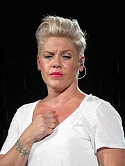

```{r setup, include = FALSE}

library(flexdashboard)
library(tidyverse)
library(titanic)
library(DT)
library(shiny)
library(rpart)
library(rpart.plot)
library(EnvStats)
library(ggtext)
library(ggthemes)

```


```{r global}

# Titanic-Daten

titanic <- titanic_train %>% 
  select(-PassengerId, -Name) %>% 
  rename(Alter = Age, Passagierklasse = Pclass, Geschlecht = Sex) %>% 
  mutate(Survived = factor(Survived),
         Survived = fct_recode(Survived, Ertrunken = "0", Gerettet = "1"),
         Geschlecht = fct_recode(Geschlecht, W = "female", M = "male"),
         Passagierklasse = factor(Passagierklasse),
         Passagierklasse = fct_recode(Passagierklasse, `1. Klasse` = "1", `2. Klasse` = "2", `3. Klasse` = "3"),
         Alter = round(Alter))

# Song-Daten

all_songs <- read_csv(file = here::here("Daten", "chart2000-songyear-0-3-0062.csv"),
                  na = c("", "-"))
attr(all_songs, "spec") <- NULL

top_artists <- all_songs %>%
  group_by(artist) %>%
  summarise(total_score = sum(indicativerevenue)) %>% 
  arrange(desc(total_score)) %>% 
  head(n = 5) %>% 
  pull(artist)

songs <- all_songs %>% 
  filter(artist %in% top_artists) %>% 
  mutate(artist = fct_infreq(artist),
         indicativerevenue = round(indicativerevenue))

```


# Shiny App

## Column {.sidebar}

### Schaltpult

```{r shiny_ui}

checkboxInput(inputId = "surrogate", label = "Fehlwerte: Ersatzvariable verwenden")

radioButtons(inputId = "firstsplit", label = "Erste Verzweigung:",
             choices = c("Algorithmus entscheidet", "Alter", "Passagierklasse"))

```

## Column

```{r shiny_server}

renderPlot({
    
          cost <- switch(input$firstsplit,
                         `Algorithmus entscheidet` = c(rep(1, 3), rep(10000, 6)),
                         `Alter` = c(100, 100, 1, rep(10000, 6)),
                         `Passagierklasse` = c(1, 100, 100, rep(10000, 6)))
          
        tree <- rpart(Survived ~ ., data = titanic, method = "class",
                      usesurrogate = ifelse(isTRUE(input$surrogate), 1, 0),
                      cp = 0.01, maxdepth = 3,
                      cost = cost)
        
        prp(tree, main = "Titanic: Wurden Frauen und Kinder zuerst gerettet?",
            type = 4,                                     # type: 1 = label all nodes
            extra = 1,                                    # extra: 1 = number of obs per node; +100: percentage
            prefix = "Ertrunken / Gerettet\nMehrheit: ",
            xsep = " / ",
            faclen = 0,                                     # do not abbreviate factor levels
            nn = FALSE,                                     # display the node numbers
            ni = TRUE,                                      # display node indices
            yesno = 2,                                      # write yes / no at every split
            roundint = TRUE,
            # ycompress = FALSE,
            yes.text = "ja",
            no.text = "nein",
            facsep = ", ",
            varlen = 0,                                     # don't abbreviate variable names
            shadow.col = "gray",
            split.prefix = " ",
            split.suffix = " ",
            # col = cols, border.col = cols,                # use for categorical outcomes, predefine colours
            box.palette = "BuGn",
            # box.palette = "auto",
            split.box.col = "lightgray",
            split.border.col = "darkgray",
            split.round = .5,
            cex = 1.1)                                        # text size


    # Kurzform:
    # rpart.plot(tree, main = title)
})

```


# Boxplot: Bilder als Achsenbeschriftungen

```{r ggtext-imagelabels, fig.width = 11, fig.height = 7}

# Download and rename files
 
labels <- c(Rihanna = "<br>*Rihanna*",
            Pink = "<br>*Pink*",
            'Maroon 5' = "<br>*Maroon 5*",
            'The Black Eyed Peas' = "<br>*Black Eyed Peas*",
            'Ed Sheeran' = "<br>*Ed Sheeran*"
            )

ggplot(songs, aes(x = artist, y = indicativerevenue, color = artist)) +
  geom_boxplot(varwidth = TRUE) +
  labs(x = "", y = "Indicative Revenue",
       title = "Indicative Revenue by Artist",
       subtitle = "Artists sorted by number of songs in Top 100 per year",
       caption = "Source: Chart2000.com, Songs of the year, Version 0-3-0062") +
  scale_color_discrete(guide = NULL) +
  scale_x_discrete(name = NULL, labels = labels) +
  stat_n_text(y.pos = 900) +
  theme_solarized(base_size = 14) +
  theme(axis.text.x = element_markdown(color = "black", angle = 0))

```